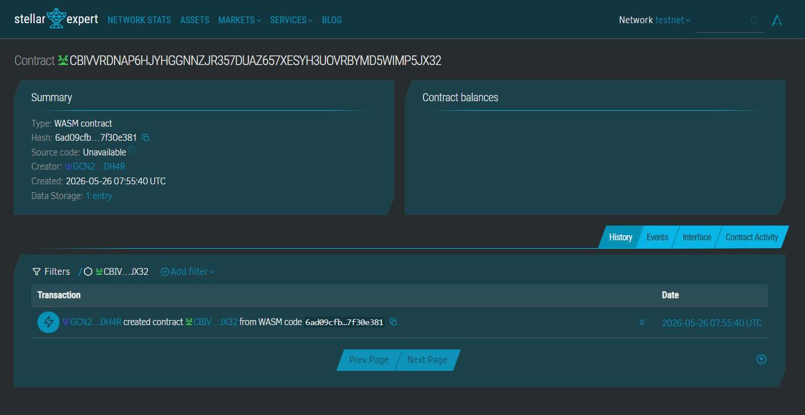

# BookFund
Group textbook pooling payments using Stellar Soroban.

## Contract ID:CBIVVRDNAP6HJYHGGNNZJR357DUAZ657XESYH3UOVRBYMD5WIMP5JX32
## Contract Link:https://stellar.expert/explorer/testnet/contract/CBIVVRDNAP6HJYHGGNNZJR357DUAZ657XESYH3UOVRBYMD5WIMP5JX32



## Problem
James, a law student in Nairobi, needs ₱3,000 worth of textbooks, but cash pooling with friends is slow and unreliable.

## Solution
BookFund lets friends pool USDC into a Soroban contract. Once the target is reached, funds are instantly released to the bookstore wallet.

## Timeline
Demo-ready in <2 minutes: init fund → contribute → release → bookstore receives payment.

## Stellar Features Used
- USDC transfers
- Soroban smart contracts
- Built-in DEX

## Vision
Make student group purchases simple, fast, and trustworthy.

## Prerequisites
- Rust
- Soroban CLI v20+

## Build
```bash
soroban contract build
